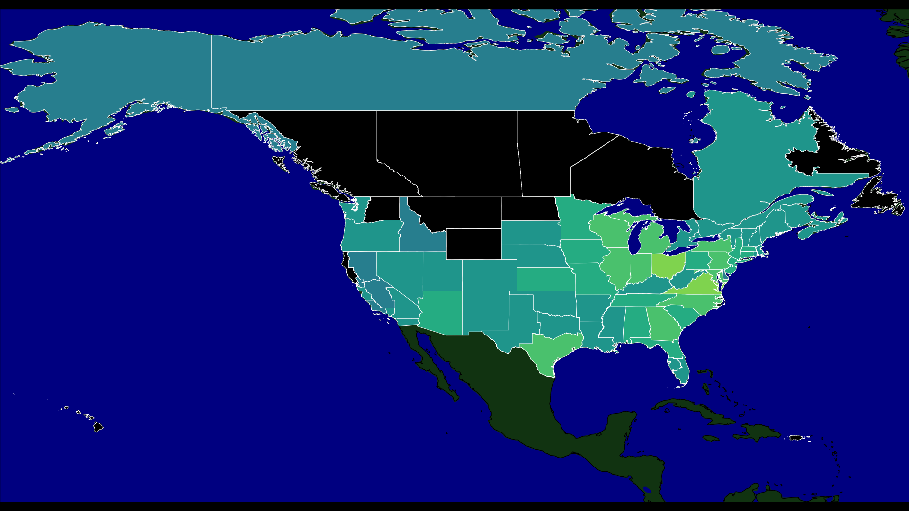
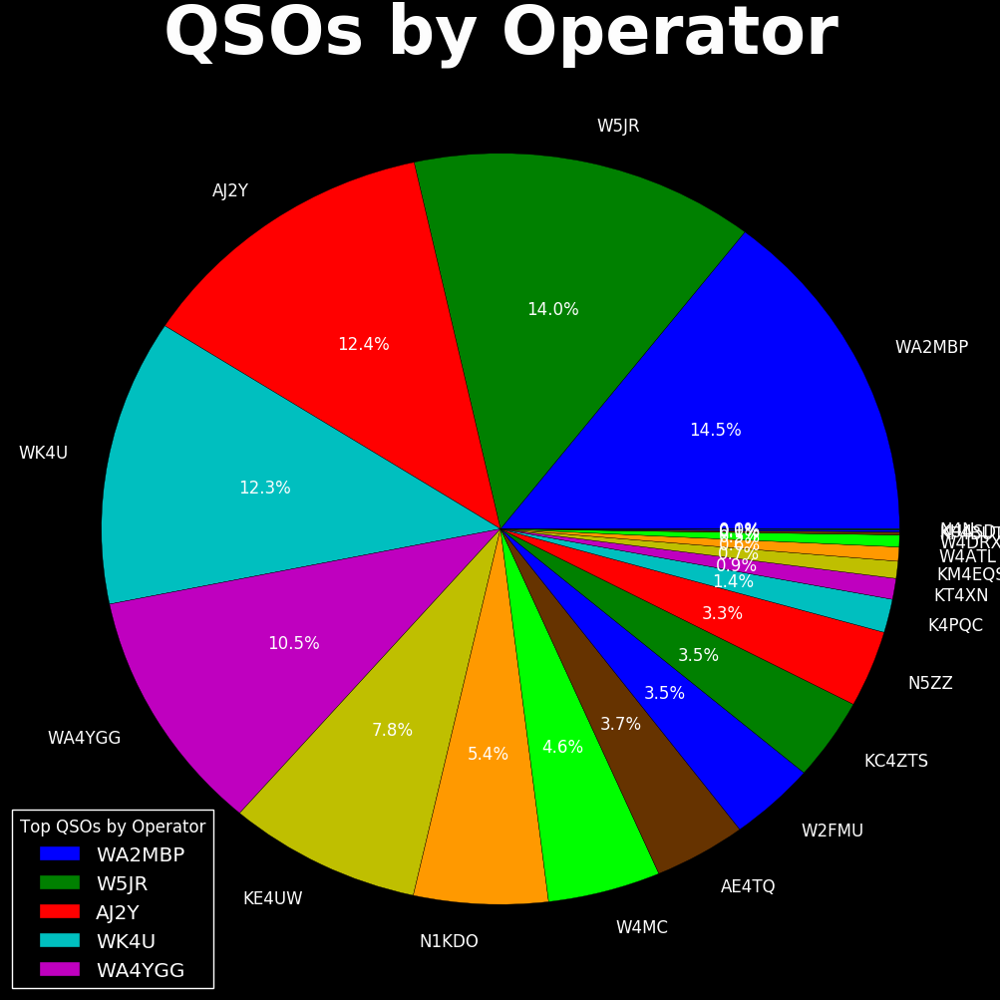
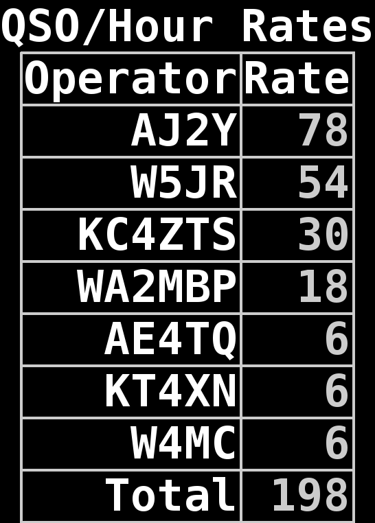

# n1mm_view

`n1mm_view` is a set of python scripts to display real-time contest QSO
 statistics for N4N ARRL Field Day.

It listens to N1MM+ or TR4W "Contact Info" UDP broadcasts (see the 
[N1MM+ documentation](http://n1mm.hamdocs.com/tiki-index.php?page=UDP+Broadcasts))
and collects the contact info into a database.  The contact info data 
is used to create useful data screens that are continuously rotated.

The contactchange and contactdelete UDP messages are also handled for changes made to the data in the logging program.

It was built to run on a Raspberry Pi and to display the statistics 
on a large television screen.  It should run anywhere its dependencies 
can be installed on, meaning it should work on Linux, Windows, and OS X.
It is known to run on the Raspberry Pi and also on Windows 7/10.

Currently, it supports the following displays:

* QSOs by Operator pie chart
* QSO by Band Pie chart
* QSOs by Mode Pie chart
* QSOs by Station Pie chart
* QSOs Summary Table
* QSO/Hour Rate Table
* Top 5 Operators by QSO Count Table
* QSOs/Hour/Band stacked chart
* Sections Worked choropleth Map, shows all US and Canada sections.

## Example Images:

### QSOs by Section:

### QSO Rate Chart:

### QSOs by Operator Chart:

### Summary Table:

### QSOs by Operator Table:

### QSO Rates Table:

## Dependencies:

(see [requirements.txt](requirements.txt))

* python 3
* python matplotlib library
* python pygame library
* python sqlite3 library
* python Cartopy library

## Components:

* collector.py -- collect contact data from n1mm+ broadcasts
* config.py -- configuration data.  edit this to change configuration.  
  In theory, the only part you should need to edit to configure n1mm_view for your environment.
* constants.py -- constant values shared by collector and dashboard.  Bands and Modes are defined here.
* dashboard.py -- display collected statistics on screen
* dataaccess.py -- module contains data access code
* graphics.py -- module contains code to create and manipulate the graphs, charts, and map.
* headless.py -- application to create graphs, charts, and maps non-interactively, producing image files. 
  Useful if you want to serve the images by http.
* one_chart.py -- application that will display one chart only. Use this when debugging charts.
* replayer.py -- test application, "replays" an old N1MM+ log to test collector and dashboard.
* init/n1mm_view_collector.service -- systemd control file, starts collector at boot
* init/n1mm_view_dashboard.service -- systemd control file, starts dashboard at boot
* shapes/* -- map shapes for every US section. Thank you, Charles.

## Installation

See [INSTALL_RASPI.md](INSTALL_RASPI.md) for information to install n1mm_view on a Raspberry Pi.
See [INSTALL_WINDOWS.md](INSTALL_WINDOWS.md) for information to install n1mm_view on Windows.

## N1MM+ Setup

N1MM+ needs to be configured to send the UDP messages. 

N1MM+ needs to be configured to send UDP contact broadcasts to N1MM_VIEW.
 
Before performing these N1MM+ changes, get the IPv4 address of the PC or Raspberry Pi that is running N1MM_VIEW. For example, the IPv4 address would look like 192.168.1.123.
 
 * On Windows, open a DOS CMD window and type _ipconfig_ 
 * On a Raspberry Pi, open a terminal window and type _ip addr_

Now open N1MM+, and open the Configurer.  Use the "Config->Configure Ports, Mode Control..." 
menu option to open the "Configurer".

From the "Configurer" window, select the "Broadcast Data" tab.  

In the "Broadcast Data" tab, check the box in front of the word "content".  
Set the IP address on that same line to be either the single, specific IP of the Raspberry Pi 
running collector.py, or set it to the proper broadcast address for your subnet. 

(I believe the proper broadcast address can be calculated from the machines's IP address ORed with the NOT of the machine's subnet mask.  I could be wrong.  But for your garden variety 192.168.1.n IP address, the broadcast address is 192.168.1.255.  That's a good place to start from.)

## Usage:

Log in to your raspberry pi.  You don't need X-window system, the dashboard can create the graphics window without X.  Open at least two login sessions.  (Alt-F1, Alt-F2, etc. to switch between virtual consoles if not running X is good.)

Change to the directory where the code is installed.

You may wish to edit the n1mm_view_config.py file to adjust the start and stop dates of field day, for instance.

You may wish to delete the n1mm_view.db database file to reset the counts to zero.  The collector.py program will re-create the database.

In one login session, start the collector:  $ ./collector.py 

The collector should display output for every QSO message it receives.  This is a good thing.

Control-C will stop the collector.

in the other login session, start the dashboard: $ ./dashboard.py

The dashboard should start up.  Eventually, graphs and tables will be displayed.  The dashboard supports the following keys:

* Q: quit
* left and right arrows: change displayed page
* scroll lock button: stop automatic page changing

If HTML_DIR is set, the dashboard will create PNG files of all the images.

If HTML_ONLY is selected, then no screen interface is displayed. (Use CTRL-\ to stop dashboard).

## License:

This software is licensed under the terms of the "Simplified BSD license", see [LICENSE](LICENSE).

Copyright 2016, 2017, 2019 Jeffrey B. Otterson, N1KDO  
All Rights Reserved

## To Do / Help Wanted!

There's more to do.  This project is still in late-prototype stage.

* add command-line options
* somebody might want to support other contests besides field day
  * multipliers table
* the `qso_log` table could be exported to ADIF.
* perhaps instead of listening to UDP packets, the N1MM log database could be read.
* A help option ("?" key?) for the dashboard to display what keys do what. 

GitHub pull requests will be happily looked at, and the odds are good that
they will be merged.  Your contributions are welcome.  See https://help.github.com/en/github/collaborating-with-issues-and-pull-requests/creating-a-pull-request 
for information on how to create a pull request

